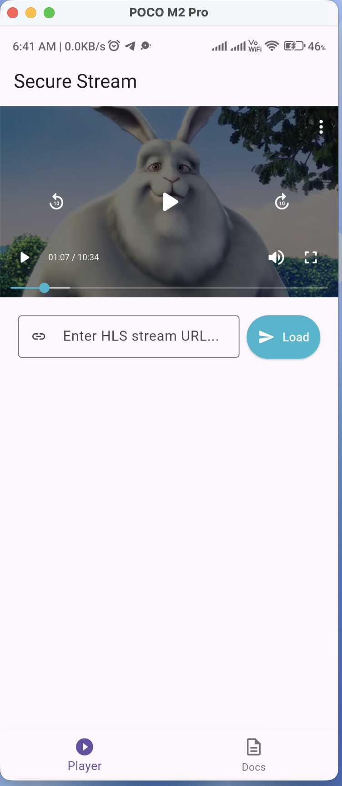
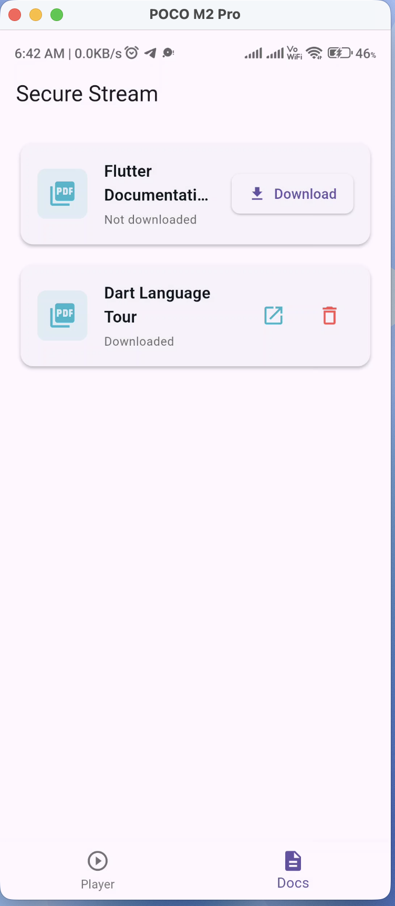
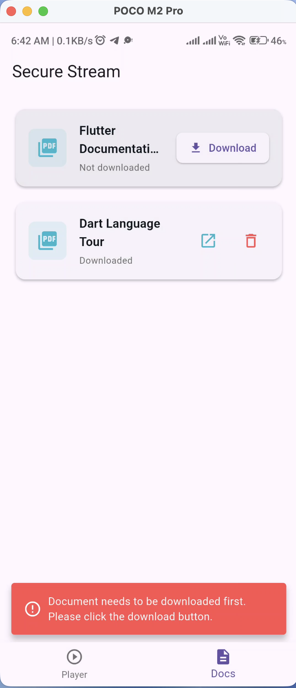
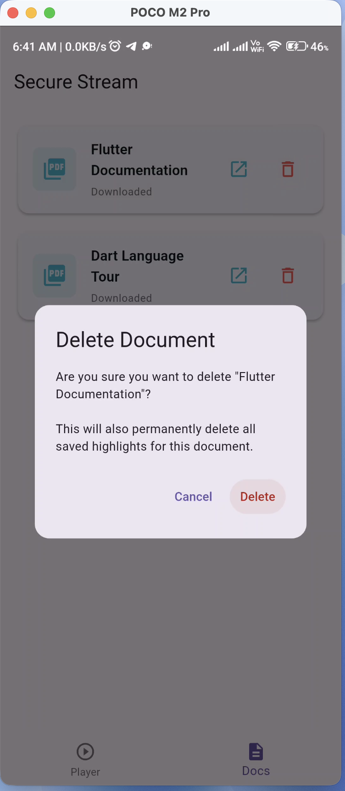
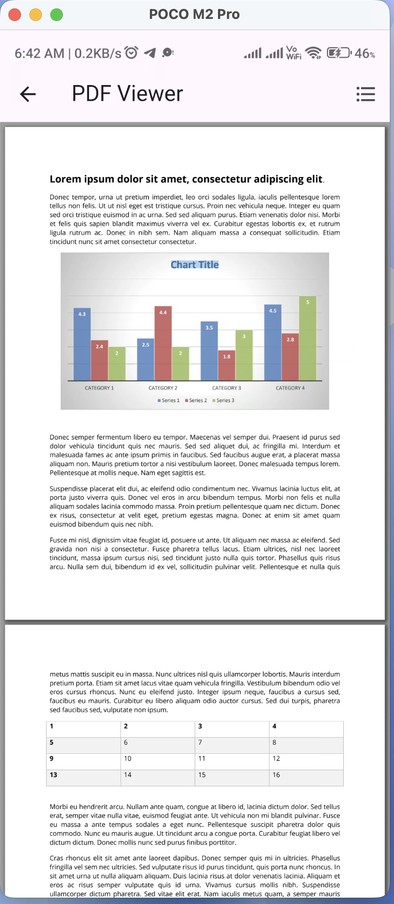
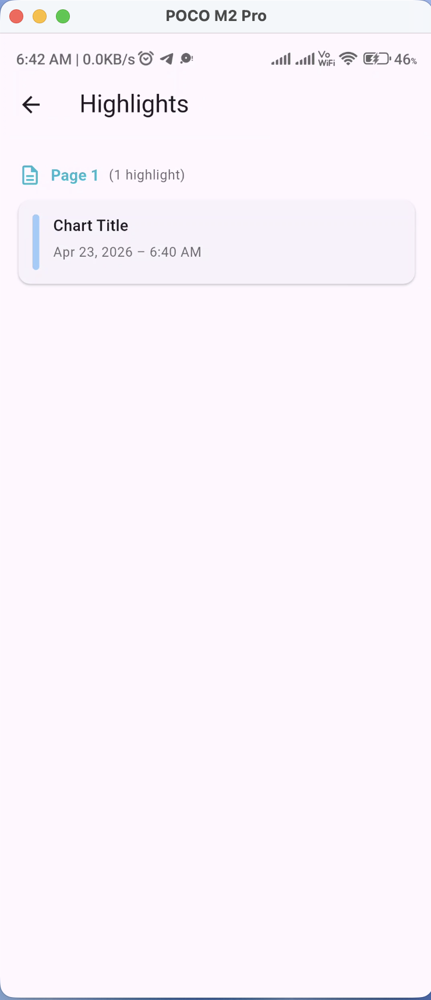

# Secure Stream Docs

> Application for **secure, encrypted PDF document management** and **HLS video streaming**  built on **Clean Architecture** with **BLoC / Cubit** state management.

<p align="center">
  
</p>

---

##  Features

###  HLS Video Player
- Adaptive-bitrate HLS streaming via `better_player_plus`
- Persistent playback position  resume exactly where you left off
- Custom HLS URL input  load any `.m3u8` stream on the fly


###  Secure PDF System
- Remote PDF download with real-time progress tracking
- AES-256 CBC encryption  files are encrypted immediately after download
- On-demand decryption into a temporary session-only file


### Text Highlights
- Select and highlight text within PDF documents
- Coordinate based overlay rendering with persistent storage
- Highlights review screen  grouped by page with timestamps
- Cascade delete  removing a document also removes its highlights

### Navigation
- Bottom tab navigation (Player / Docs) with persistent state
- Full-screen routes for PDF viewer and highlights review
- Type-safe routing via `go_router_builder`

---

##  Screenshots

<table>
  <tr>
    <td align="center"><strong>Video Player</strong></td>
    <td align="center"><strong>Document List</strong></td>
    <td align="center"><strong>Download Guard</strong></td>
  </tr>
  <tr>
    <td></td>
    <td></td>
    <td></td>
  </tr>
  <tr>
    <td align="center"><strong>Delete Confirmation</strong></td>
    <td align="center"><strong>PDF Viewer</strong></td>
    <td align="center"><strong>Highlights Review</strong></td>
  </tr>
  <tr>
    <td></td>
    <td></td>
    <td></td>
  </tr>
</table>

---

## Architecture

The project follows **Clean Architecture** with feature-based modular organization:

```
lib/
├── core/                     # Shared infrastructure
│   ├── di/                   # Dependency injection (GetIt)
│   ├── error/                # Failure types & exception mapping
│   ├── local/                # Isar database initialization
│   ├── network/              # Dio HTTP client & interceptors
│   ├── router/               # GoRouter configuration
│   ├── security/             # AES-256 file encryption service
│   ├── ui/                   # Design system (colors, text styles, sizes)
│   ├── usecases/             # Base UseCase<Result, Params> contract
│   └── utils/                # Shared helpers & utilities
│
└── features/
    ├── home/                 # Navigation shell (bottom tab bar)
    ├── documents/            # PDF list → download → viewer → highlights
    │   ├── data/             #   Repository impl, data sources, models
    │   ├── domain/           #   Entities, contracts, use cases
    │   └── presentation/     #   Screens, BLoC/Cubit, widgets
    └── video_player/         # HLS streaming & playback persistence
        ├── data/
        ├── domain/
        └── presentation/
```

### Layer Rules

| Layer | Depends On | Never Depends On |
|---|---|---|
| **Presentation** | Domain (via Use Cases) | Data |
| **Domain** | Nothing (pure Dart) | Flutter, Data |
| **Data** | Domain (implements contracts) | Presentation |

> Full architecture documentation → [`docs/ARCHITECTURE.md`](docs/ARCHITECTURE.md)

---

## Security Model

```
Download → Encrypt (AES-256 CBC) → Delete raw PDF → Store .enc
                                                        │
Open → Decrypt .enc → Write to OS temp dir → Render → OS auto-cleanup
```

- **Encryption**: AES-256 CBC via the `encrypt` package
- **Isolate offloading**: Both encrypt/decrypt run inside `compute()` to avoid UI jank
- **Zero plaintext persistence**: Decrypted files live only in the system temp directory

---

## Tech Stack

| Category | Technology |
|---|---|
| **Framework** | Flutter 3.x (Dart ^3.10) |
| **State Management** | `flutter_bloc` / `bloc` 8.x |
| **Navigation** | `go_router` 17.x + `go_router_builder` |
| **Video Player** | `better_player_plus` 1.x |
| **PDF Renderer** | `pdfrx` 2.x |
| **Local Database** | `isar_community` 3.x |
| **Encryption** | `encrypt` 5.x (AES-256 CBC) |
| **HTTP Client** | `dio` 5.x |
| **DI** | `get_it` 7.x |
| **Error Handling** | `dartz` 0.10 (`Either<Failure, T>`) |
| **Responsive** | `flutter_screenutil` 5.x |

---

## Getting Started

### Prerequisites

- Flutter SDK `^3.10.0`
- Dart SDK `^3.10.4`
- Android Studio / Xcode
- A physical device or emulator (Android API 21+ / iOS 12+)

### Setup

```bash
# 1. Clone the repository
git clone https://github.com/your-org/secure_stream_docs.git
cd secure_stream_docs

# 2. Install dependencies
flutter pub get

# 3. Generate Isar schemas and route code
dart run build_runner build --delete-conflicting-outputs
```

### Run

The project supports three flavors: **dev**, **stage**, and **prod**.

```bash
# Development
flutter run --flavor dev -t lib/main_dev.dart

# Staging
flutter run --flavor stage -t lib/main_stage.dart

# Production
flutter run --flavor prod -t lib/main_prod.dart
```


---

## Project Structure

```
secure_stream_docs/
├── android/                  # Android platform configuration
├── ios/                      # iOS platform configuration
├── assets/
│   └── images/               # App icon and splash assets
├── docs/
│   ├── assets/               # Screenshots and GIFs
│   └── ARCHITECTURE.md       # Detailed architecture document
├── lib/
│   ├── core/                 # Shared modules
│   ├── features/             # Feature modules
│   ├── my_app.dart           # MaterialApp + Router + BLoC providers
│   ├── main.dart             # Entry point (default)
│   ├── main_dev.dart         # Dev flavor entry
│   ├── main_stage.dart       # Stage flavor entry
│   ├── main_prod.dart        # Prod flavor entry
│   └── flavors.dart          # Flavor enum and config
├── pubspec.yaml
└── README.md
```

---

## Local Database (Isar)

| Collection | Purpose |
|---|---|
| `DocumentModel` | PDF metadata, download state, encrypted file path |
| `HighlightModel` | Per-document text highlights with page coordinates |
| `VideoModel` | Video URL, last playback position, custom URL flag |

---

## State Management Map

| Component | Type | Scope |
|---|---|---|
| `DocumentsBloc` | `Bloc` | Global — provided at app level |
| `ViewerCubit` | `Cubit` | Scoped — created per PDF viewer route |
| `HighlightCubit` | `Cubit` | Scoped — created per PDF viewer route |
| `VideoPlayerBloc` | `Bloc` | Global — provided at app level |

---

## Route Map

| Path | Screen | Nav Bar |
|---|---|---|
| `/player` | Video Player |  Visible |
| `/docs` | Document List |  Visible |
| `/docs/:id` | PDF Viewer |  Hidden |
| `/docs/:id/highlights` | Highlights Review |  Hidden |

---

